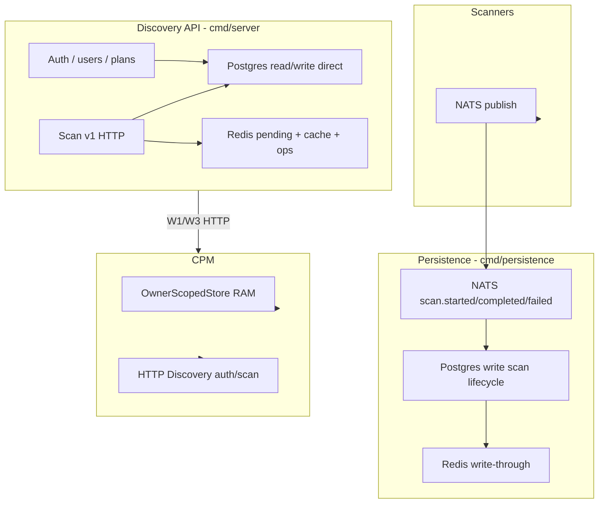
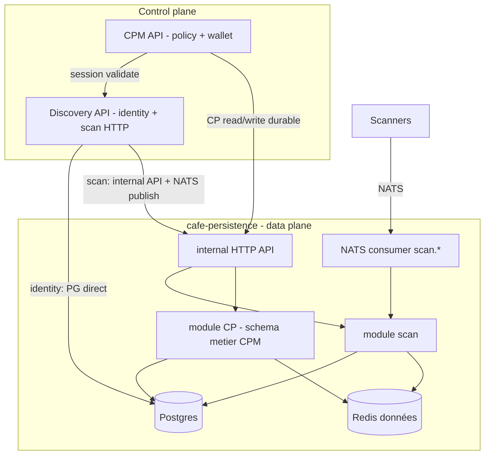
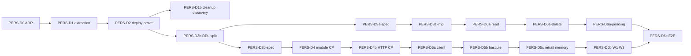

# ADR — Plateforme de persistance CAFE (cafe-persistence)


| Champ                | Valeur                                                                                                                                                                                                                                                                                                                                                                                                                                                    |
| -------------------- | --------------------------------------------------------------------------------------------------------------------------------------------------------------------------------------------------------------------------------------------------------------------------------------------------------------------------------------------------------------------------------------------------------------------------------------------------------- |
| **Statut**           | Proposition v1.4.4 — **architecture** signable ; §14 index aligné sur [ADR_20260622_PR_PLAN.md](./ADR_20260622_PR_PLAN.md)                                                                                                                                                                                                                                                                                                                                                |
| **Date**             | 2026-06-22                                                                                                                                                                                                                                                                                                                                                                                                                                                |
| **Décideurs**        | Architecture CAFE (Discovery, CPM, deploy)                                                                                                                                                                                                                                                                                                                                                                                                                |
| **Remplace / étend** | Vérification single-writer du 2026-02-22 (§2 ci-dessous conservé comme baseline factuelle)                                                                                                                                                                                                                                                                                                                                                                |
| **Documents liés**   | `[SCAN_IMMUTABILITY_MIGRATION.md](./SCAN_IMMUTABILITY_MIGRATION.md)`, `[cafe-crypto-policy-mgt/workplans/WORKPLAN_API.md](../../cafe-crypto-policy-mgt/workplans/WORKPLAN_API.md)` §2.2 (W1–W8), `[cafe-crypto-policy-mgt/docs/CP_PERSIST.md](../../cafe-crypto-policy-mgt/docs/CP_PERSIST.md)` §42 |


---

## 1. Contexte

CAFE combine trois surfaces produit :

- **Discovery** — scans wallet/TLS, identity (auth, plans), guards d’immutabilité W1–W8 ;
- **CPM** — explore, drafts, persist CP (EOA), assessment ;
- **Persistence** (aujourd’hui `cmd/persistence` dans `cafe-discovery`) — writer async des scans via NATS.

Une vérification code du **2026-02-22** a montré que le principe *single-writer* n’est appliqué que partiellement : le backend Discovery accède encore directement à Postgres et Redis pour les scans, en plus du persistence-service.

Parallèlement, les **Crypto Policies (CP)** sont stockées en **mémoire process** dans CPM (`OwnerScopedStore`) : un restart efface les policies, alors que les scans sont durables.

Cette ADR consolide la vérification initiale et la **décision d’architecture cible** : extraire le persistence-service vers un repo plateforme **cafe-persistence**, y ajouter un module CP à schéma métier CPM, et réduire l’accès direct Postgres/Redis de Discovery au **plan identity** uniquement (état final).

---

## 2. État actuel (vérification factuelle — 2026-02-22)

### 2.1 Trois processus, une base partagée




### 2.2 Discovery API — accès Postgres / Redis


| Domaine                      | Postgres                                | Redis                                  | Contourne persistence ?                     |
| ---------------------------- | --------------------------------------- | -------------------------------------- | ------------------------------------------- |
| Migrations + bootstrap plans | Oui (`container.go` `runMigrations`)    | —                                      | Oui (DDL dupliqué avec persistence)         |
| Auth (signup, signin, JWT)   | Oui (`users`, `plans`)                  | —                                      | Oui                                         |
| Plans / quotas POST scan     | Oui (users + comptages scan)            | —                                      | Oui                                         |
| `cafe_wallets`               | Oui                                     | —                                      | Oui                                         |
| POST v1 scan (`requested`)   | Non (v1)                                | Oui (`pending_scan`, `pending_wallet`) | Partiel (NATS → persistence pour lifecycle) |
| GET/DELETE scans v1          | Oui (`scan_result_repository`)          | Invalidation cache                     | **Oui**                                     |
| Warm cache au sign-in        | Oui → Redis                             | Oui                                    | Oui                                         |
| Scanner presence             | —                                       | Oui (heartbeat)                        | Oui (ops, pas données métier)               |
| Legacy sync scan             | Oui (`DiscoveryService.saveScanResult`) | —                                      | Oui                                         |


**Fichiers clés :** `internal/app/container.go`, `internal/handler/discovery_v1_scans.go`, `internal/repository/pending_v1_scan_repository.go`, `internal/service/user_scan_cache.go`.

### 2.3 Persistence-service (`cmd/persistence`)

- **Rôle :** consumer NATS ; writer idempotent Postgres + Redis pour le **lifecycle async** scan (`started` → `completed`/`failed`).
- **Pas d’API HTTP** aujourd’hui — uniquement NATS in / PG+Redis out / `persistence.ready` / observation wallet.
- **DDL :** `AutoMigrate` sur `scan_results`, `tls_scan_results`, `scan_usage_events` (+ index IMM-2/IMM-6b).
- **Lecture users/plans :** `planlimit.Resolver` pour quotas à la complétion (IMM-6b).

**Fichiers clés :** `cmd/persistence/main.go`, `internal/persistence/handlers/scan_events.go`, `internal/persistence/storage/postgres.go`, `internal/persistence/storage/redis.go`.

### 2.4 Scanners

**Pas d’accès Postgres.** Execution plane : NATS + chain config uniquement (`internal/scanner/core/deps.go`).

### 2.5 CPM


| Domaine                    | Stockage                    | Remarque                           |
| -------------------------- | --------------------------- | ---------------------------------- |
| Drafts / policies          | RAM (`OwnerScopedStore`)    | Perdu au restart                   |
| Auth / scan context        | HTTP Discovery              | Pas de SQL                         |
| Wallet proof CP-PERSIST V1 | Stateless (pas de Redis V1) | V2 proof-store optionnel, distinct |
| Références W1/W3           | HTTP interne CPM            | Données volatiles                  |


**Fichier clé :** `cafe-crypto-policy-mgt/internal/persistence/owner_scoped_store.go`.

### 2.6 Écart documentation vs réalité (scan)


| Sujet                        | Doc / intention              | Code                                                                                         |
| ---------------------------- | ---------------------------- | -------------------------------------------------------------------------------------------- |
| Single-writer scan lifecycle | Persistence seul writer      | Vrai pour **completed/failed** via NATS ; faux pour GET/DELETE/pending/read-through côté API |
| Double migration             | —                            | Backend **et** persistence migrent les tables scan                                           |
| CP durables                  | Métadonnées §13.2 CP_PERSIST | Pas de Postgres côté CPM                                                                     |


---

## 3. Problème et drivers

1. **Durabilité CP** — restart CPM = perte des policies ; incohérent avec le cycle de vie scan.
2. **Double DDL** — `scan_results` migré par deux binaires ; risque de dérive schéma.
3. **Frontières floues** — persistence vivant dans `cafe-discovery` ; pas de place naturelle pour les tables CP sans mélanger domaines.
4. **Guards W1/W3** — références CP sur store volatile ; W1 dépend du scan JSON payload (`TODO` CPM IMM-9b).
5. **Évolution plateforme** — `CP_PERSIST.md` §42 et la vérification architecture (2026-02, annexe A) pointent déjà vers une extraction persistence ; le besoin CP accélère la décision.

---

## 4. Objectif (architecture cible)

### 4.1 Principes

1. **cafe-persistence** = **data plane** : seul owner opérationnel des migrations DDL données produit (scans, ledger, CP) et des writers durables + cache Redis **données**.
2. **Discovery API** = **control plane scan + identity** : HTTP public, guards W1–W8, publish NATS ; **pas de code CP** dans `cafe-discovery`.
3. **CPM** = **control plane policy** : explore, validation, wallet-auth, contrat HTTP `/api/cpm/v1` ; **pas d’accès direct** Postgres/Redis.
4. **Scanners** = execution plane inchangé (NATS only).
5. **API publiques stables** — les contrats HTTP exposés aux clients (navigateur, CLI, intégrateurs) **ne changent pas** dans le cadre de cette ADR (voir §4.4).

### 4.2 Règle d’accès Postgres / Redis (état final — phase D6)


| Service              | Postgres direct                                                                                                       | Redis direct                                                                |
| -------------------- | --------------------------------------------------------------------------------------------------------------------- | --------------------------------------------------------------------------- |
| **cafe-persistence** | Oui (SoT)                                                                                                             | Oui (cache + pending données)                                               |
| **Discovery API**    | **Identity plane uniquement** : `users`, `plans`, `cafe_wallets`, lectures nécessaires aux guards quota sur POST scan | **Idéalement aucun** données ; exception **ops** tolérée : scanner presence |
| **CPM**              | Non                                                                                                                   | Non                                                                         |
| **Scanners**         | Non                                                                                                                   | Non                                                                         |


> **Identity plane** (exception Discovery) : auth (signup/signin/JWT), gestion plans côté API, `cafe_wallets`, et lectures quota **users/plans** pour accepter ou refuser un POST scan. Ce n’est pas limité au mot « auth » au sens étroit — c’est tout ce qui relève du **tenant utilisateur**, pas des artefacts scan/CP.

> **Auth dans cafe-persistence** : **reporté** (voir §10). Discovery garde les handlers HTTP auth et `POST /internal/auth/session/validate` pour CPM.

### 4.3 Diagramme cible



### 4.4 Stabilité des API publiques (objectif non négociable)

L’extraction cafe-persistence et le module CP sont des changements **internes** (data plane). Ils **ne doivent pas** imposer de migration côté clients.

| Surface publique | Préfixe canonique (edge) | Référence normative | Inchangé |
|------------------|--------------------------|---------------------|----------|
| **Discovery** | `/api/discovery/v1` | `cafe-discovery/openapi/discovery-v1.yaml` | Oui — auth, scans wallet/TLS, plans |
| **CPM** | `/api/cpm/v1` | `cafe-crypto-policy-mgt/openapi/cpm-v1.yaml` | Oui — explore, drafts, wallet-challenges, persist, policies |

**Clients concernés sans modification attendue :**

- SPA (`cafe-frontend`) — `VITE_API_URL`, `VITE_CPM_API_BASE_URL` ;
- CLI / `cafe.sh` ;
- scripts et smokes `cafe-deploy` qui appellent les routes publiques existantes.

**Ce qui reste identique pour les clients :**

- chemins URL, verbes HTTP, corps de requête et réponses documentés dans les OpenAPI v1 ;
- parcours produit CP-PERSIST V1 : `wallet-challenges` → signature → `POST …/drafts/{draft_id}/persist` ;
- corrélation par `scan_id`, Bearer Discovery, codes d’erreur **documentés** (les réponses peuvent devenir **plus fiables**, ex. durabilité après restart, sans changer le contrat).

**Hors périmètre « API publique » (peut évoluer sans impact client produit) :**

- API **internes** service-à-service (`/internal/…`, contrats D3a/D3b cafe-persistence) ;
- déploiement ops (nouveau conteneur cafe-persistence, variables d’environnement backend).

**Pas de nouvelle API publique** du type `/api/persistence/v1` pour le produit.

---

## 5. Décision — Option D : cafe-persistence

### 5.1 Décision

1. **Extraire** `cmd/persistence` et les packages associés vers un nouveau dépôt **cafe-persistence** (service plateforme).
2. **Conserver** le comportement scan inchangé à l’extraction (mêmes sujets NATS, mêmes tables, même image compose en transition).
3. **Centraliser** l’**init DB / migrations** données dans cafe-persistence uniquement (fin du double `AutoMigrate`).
4. **Ajouter** un **module CP** : schéma et sémantique métier **définis par CPM** ; exécution, DDL et stockage **opérés par cafe-persistence** ; **aucune dépendance métier Discovery** dans ce module (voir §8.2).
5. **Exposer** deux familles de **contrats internes synchrones** (HTTP ou gRPC), livrables incrémentalement (voir §7, §9) :
   - **contrat scan** : pending, read, delete, ledger (complément NATS) ;
   - **contrat CP** : CRUD drafts/policies, persist, références d’existence W1/W3.
6. **CPM** délègue les **écritures et lectures durables CP** à cafe-persistence ; garde authz wallet, explore, et le contrat HTTP public ; respecte le profil résilience §5.5–§5.6 sur tout le chemin critique durable CP.
7. **Discovery** ne contient **aucun code CP** ; à terme W1/W3 appellent cafe-persistence pour des **vérifications d’existence** uniquement — pas de logique policy dans Discovery (voir §9.3, critères §11).
8. **Auth** reste dans Discovery pour l’instant ; migration vers un service identity / module séparé **plus tard**.
9. **Stabilité API publiques** — aucun breaking change sur `/api/discovery/v1` ni `/api/cpm/v1` ; les clients existants continuent sans modification (§4.4, §12).

### 5.2 Alternatives écartées


| Option                                                                        | Raison du rejet                                                          |
| ----------------------------------------------------------------------------- | ------------------------------------------------------------------------ |
| **A** — Tables CP dans Postgres Discovery / étendre `cmd/persistence` in-repo | Mélange domaines ; Discovery porterait du code CP                        |
| **B** — Postgres dédié dans CPM seulement                                     | Duplication patterns ; double DDL ; CPM accède SQL                       |
| **C** — Big-bang service unifié immédiat (scans + CP + auth)                  | Trop large ; auth ≠ data plane                                           |
| NATS-only pour persist CP                                                     | Persist CP est synchrone (signature wallet) ; API interne plus naturelle |


### 5.3 Conséquences positives

- Durabilité CP alignée sur les scans ; survive restart.
- Un seul owner DDL données ; smokes restart cohérents.
- Frontières repo claires : zero CP dans Discovery.
- CPM reste sans SQL ; tests d’intégration via contrats internes.
- Base pour futurs domaines (audit ledger CP, remediation refs).

### 5.4 Conséquences / risques

- Nouveau repo + pipeline deploy (`cafe-deploy` : cafe-persistence remplace `cafe-discovery-persistence` en alias).
- Contrats internes à versionner séparément (`cafe-contracts` ou OpenAPI interne scan vs CP).
- Phase transitoire : Discovery lit encore Postgres scan jusqu’à D6 — **dette documentée**.
- Chemin critique : toutes les opérations durables CP (persist **et** GET draft/policy/list) dépendent de cafe-persistence une fois `CPM_STORE=persistence` (§5.5).
- W1/W3 : migration des appels Discovery CPM → cafe-persistence (existence seulement, §9.3).

### 5.5 Chemin critique — CPM ↔ cafe-persistence (lectures et écritures)

La règle « CPM sans accès direct Postgres/Redis » place cafe-persistence sur le **chemin synchrone** de toutes les opérations durables CP (pas seulement `POST …/persist`).

**Opérations concernées :** `UpsertDraft`, `GetDraft`, `DeleteDraft`, `PersistDraft`, `GetPolicy`, `DeletePolicy`, `ListPoliciesByScan`.

| Sujet | Règle |
|-------|--------|
| **Timeout client CPM → persistence** | Configurable (`CPM_PERSISTENCE_TIMEOUT` indicatif) ; borne supérieure alignée UX wallet (ex. 10–15 s hors signature utilisateur). |
| **Retries** | **Uniquement** sur opérations **idempotentes** : `PersistDraft` (`draft_id`) ; `Get*` / `List*` / `Count*` (refs W1/W3). **Pas** de retry aveugle sur effets non idempotents sans clé. |
| **Clé d’idempotence** | `draft_id` (+ `user_id` / `tenant_id` scope) ; cafe-persistence garantit `DRAFT_ALREADY_PERSISTED` / même `policy_id` au retry (équivalent `PersistDraftOnce` actuel). |
| **Indisponibilité persistence (écriture)** | cafe-persistence → **503** `PERSISTENCE_UNAVAILABLE` ; CPM mappe en **503** public — **pas** de faux succès, **pas** de persist partiel en mémoire. |
| **Indisponibilité persistence (lecture)** | `GET` draft/policy/list → **503** public ; **pas** de cache stale côté CPM ; **pas** de repli sur `OwnerScopedStore` lorsque `CPM_STORE=persistence` (rollback memory possible en **D5b** tant que D5c n’a pas retiré le code). |
| **Timeout / erreur réseau** | CPM → **503** ; le client peut réessayer les lectures ; pour persist, retry **uniquement** si idempotence sûre (`draft_id`) ou après `GET` de vérification. |
| **Santé deploy** | cafe-persistence **ready** (migrations appliquées + sonde HTTP interne) avant trafic CPM en mode `persistence` ; smokes D5 (`cafe-deploy`). |

### 5.6 Bascule CPM — rollout progressif (PERS-D5)

Éviter une bascule atomique « tout memory → tout persistence » en une seule PR.

| Mécanisme | Règle |
|-----------|--------|
| **`CPM_STORE`** | `memory` (défaut) \| `persistence` — sélecteur explicite jusqu’à fin de fenêtre D5b ; `memory` reste disponible en dev/tests. |
| **PERS-D5a** | Client HTTP + mapping §5.5 ; **`CPM_STORE=memory` par défaut** ; intégration testable contre `internal/cp/v1` (post-D4b). |
| **PERS-D5b** | Activer `CPM_STORE=persistence` staging → prod ; smokes restart ; **`OwnerScopedStore` encore présent** (rollback = repasser `CPM_STORE=memory`). |
| **PERS-D5c** | Après fenêtre de stabilité documentée : retirer le chemin prod `OwnerScopedStore` (code supprimé ou réservé tests uniquement). |
| **Canary (recommandé)** | Staging d’abord ; prod D5b avec rollback env ; **D5c** seulement après N jours / smokes verts sans incident. |
| **Post-D5c** | Plus de repli memory en prod ; indisponibilité persistence = **503** (§5.5). |

---

## 6. User stories

### 6.1 Opérateur / SRE


| ID           | En tant que… | Je veux…                                                   | Afin de…                                 | Phase |
| ------------ | ------------ | ---------------------------------------------------------- | ---------------------------------------- | ----- |
| **US-OPS-1** | opérateur    | qu’un restart `cafe-cpm` ne supprime pas les CP persistées | garantir la continuité produit           | D4–D5 |
| **US-OPS-2** | opérateur    | un seul service qui migre le schéma données (scan + CP)    | éviter les dérives DDL entre binaires    | D1    |
| **US-OPS-3** | opérateur    | des smokes « persist CP → restart stack → GET policy OK »  | valider la durabilité en CI              | D5–D6 |
| **US-OPS-4** | opérateur    | conserver le même flux NATS scan après extraction          | ne pas casser les déploiements existants | D1–D2 |


### 6.2 Utilisateur produit (wallet / CP)


| ID            | En tant que… | Je veux…                                                      | Afin de…                           | Phase |
| ------------- | ------------ | ------------------------------------------------------------- | ---------------------------------- | ----- |
| **US-PROD-1** | utilisateur  | que ma CP reste attachée à mon scan après maintenance serveur | ne pas refaire explore + signature | D5    |
| **US-PROD-2** | utilisateur  | qu’une policy persistée bloque le rescan (W1) de façon fiable | respecter l’immutabilité produit   | D4–D6 |
| **US-PROD-3** | utilisateur  | ne pas pouvoir supprimer un scan référencé par une CP (W3)    | éviter les policies orphelines     | D4–D6 |
| **US-PROD-4** | utilisateur  | le même parcours HTTP (draft → sign → persist) qu’aujourd’hui | aucune régression UX               | D5    |


### 6.3 Développeur Discovery


| ID            | En tant que…  | Je veux…                                                     | Afin de…                                          | Phase   |
| ------------- | ------------- | ------------------------------------------------------------ | ------------------------------------------------- | ------- |
| **US-DISC-1** | dev Discovery | zéro import / table / handler CP dans `cafe-discovery`       | respecter la frontière domaine                    | D0+     |
| **US-DISC-2** | dev Discovery | appeler `cafe-persistence` pour GET/DELETE scan (état final) | ne plus maintenir de read path Postgres scan      | D6      |
| **US-DISC-3** | dev Discovery | garder auth et session validate sur Discovery                | ne pas déplacer JWT/Turnstile avant le bon moment | continu |
| **US-DISC-4** | dev Discovery | appeler cafe-persistence pour une **existence** policy par adresse (W1) | appliquer le guard sans logique CP locale | D4–D6 |


### 6.4 Développeur CPM


| ID           | En tant que… | Je veux…                                                        | Afin de…                             | Phase |
| ------------ | ------------ | --------------------------------------------------------------- | ------------------------------------ | ----- |
| **US-CPM-1** | dev CPM      | déléguer `PersistDraftOnce` au data plane                       | supprimer `OwnerScopedStore` en prod | D5c   |
| **US-CPM-2** | dev CPM      | un module CP dans cafe-persistence sans import Discovery scan ; schéma métier validé par CPM | découplage + ownership §8.2          | D3b–D4 |
| **US-CPM-3** | dev CPM      | colonne `wallet_address` indexée côté data plane                | W1 fiable sans scan JSON             | D4    |
| **US-CPM-4** | dev CPM      | ne jamais ouvrir `CPM_DATABASE_URL` dans le binaire CPM         | frontière stricte                    | D5    |
| **US-CPM-5** | dev CPM      | timeouts, retries idempotents et 503 mappés sur indisponibilité persistence | chemin critique durable CP fiable (lectures incluses) | D5    |


### 6.5 Développeur plateforme (`cafe-persistence`)


| ID            | En tant que…    | Je veux…                                          | Afin de…                              | Phase  |
| ------------- | --------------- | ------------------------------------------------- | ------------------------------------- | ------ |
| **US-PERS-1** | dev persistence | modules `scan` et `cp` isolés dans le repo        | évolution indépendante                | D1, D4 |
| **US-PERS-2** | dev persistence | contrats internes **scan** et **CP** versionnés séparément | livraison incrémentale D3a / D3b | D3a, D3b |
| **US-PERS-3** | dev persistence | NATS scan inchangé + serveur HTTP interne (contrats D3a puis D3b) | async + sync dans un même data plane | D3a, D3b |
| **US-PERS-4** | dev persistence | Redis clés préfixées `cpm:v1:` / `discovery:v1:`  | partage cluster Redis sans collision  | D1+    |


---

## 7. Proposition de réarchitecture — phasage


| Phase   | Objectif                | Discovery et PG/Redis                                         | Livrable                                                                                    |
| ------- | ----------------------- | ------------------------------------------------------------- | ------------------------------------------------------------------------------------------- |
| **D0**  | Acter les frontières    | Inchangé                                                      | ADR acceptée ; règle « zero CP in Discovery »                                               |
| **D1**  | Extraction mécanique    | Inchangé (exception temporaire scan)                          | Repo cafe-persistence ; binaire scan = comportement identique ; critère DDL §14.5 ; **rollback** Discovery conservé jusqu’à D2 (§14.3) |
| **D2**  | Prouver stack           | Inchangé côté API                                             | Compose / images cafe-persistence ; smokes scan v1 verts ; **puis** D1b cleanup Discovery |
| **D2b** | DDL scan unique         | Discovery ne migre plus tables scan                           | Boot order persistence ready avant trafic scan API (§14.4)                                  |
| **D3a** | Contrat interne **scan** | Inchangé                                                     | OpenAPI interne scan : pending, read, delete, ledger (parallèle D3b)                      |
| **D3b** | Contrat interne **CP**  | Inchangé                                                     | OpenAPI interne CP : CRUD drafts/policies, persist, refs existence — **indépendant de D3a-impl** |
| **D4**  | Module CP (stockage)    | Inchangé                                                      | Tables `crypto_policy_*` ; writers/repos ; **Postgres only P0** (Redis CP P1+, §8.2)         |
| **D4b** | HTTP interne CP         | Inchangé                                                      | Handlers `internal/cp/v1` + tests contract (miroir D3a-impl)                                |
| **D5**  | CPM délègue             | Inchangé                                                      | D5a client → D5b bascule → D5c retrait memory ; §5.5–§5.6 ; HTTP public inchangé            |
| **D6**  | Identity-only Discovery | **Cible** : Discovery ne lit plus Postgres/Redis pour scan/CP | D6a-read → D6a-delete → D6a-pending ; W1/W3 via contrat CP (existence only)               |


> La règle « Discovery = identity plane seulement pour PG/Redis » est l’**invariant D6**, pas une contrainte dès D1.

---

## 8. Modules cafe-persistence (sketch)

### 8.1 Module scan (domaine métier Discovery)

- Entrée : NATS `scan.started`, `scan.completed`, `scan.failed`
- Stockage : `scan_results`, `tls_scan_results`, `scan_usage_events`
- Redis : `discovery:v1:pending_*`, `wallet:user:*`, `tls:user:*` (write-through)
- Sortie : `scan.ready`, observation wallet v0.1
- **Ownership** : schéma et règles scan = Discovery ; exécution DDL/stockage = cafe-persistence.

### 8.2 Module CP — ownership métier vs opérationnel

| Dimension | Owner | Responsabilité |
|-----------|-------|----------------|
| **Schéma & sémantique données CP** | **CPM** (métier) | Colonnes, statuts (`persisted` / `superseded`), payload JSON, invariants persist-once, évolution via PR CPM + revue contrat |
| **DDL, migrations, writers** | **cafe-persistence** (opérationnel) | `AutoMigrate`, transactions, repositories, SLO, backups |
| **Handlers HTTP `internal/cp/v1`** | **cafe-persistence** (D4b) | Implémentation contrat D3b ; tests contract ; non exposé edge |
| **Cache Redis CP** | **cafe-persistence** (P1+, optionnel) | Hors chemin de vérité ; accélérateur pending/existence uniquement |
| **Règles produit CP** (explore, ranking, wallet-auth) | **CPM** | Hors module CP persistence |
| **Guards scan** (W1/W3 côté Discovery) | **Discovery** | Interprète le code HTTP / `exists` ; **ne** implémente **pas** la logique policy |

**Règle anti-frontière :** CPM définit le contrat et les types ; cafe-persistence implémente le stockage. Les changements de schéma CP passent par un **contrat versionné** (D3b), pas par des imports Go cross-repo ad hoc.

- Entrée : API interne synchrone (contrat CP, §9.2)
- Stockage : `crypto_policy_drafts`, `crypto_policies`, `draft_persist_state` (idempotence)
- **P0 (PERS-D4) :** vérité CP = **Postgres uniquement** ; pas de Redis sur le chemin de lecture/écriture durable
- **P1+ (repoussable) :** Redis `cpm:v1:pending_persist:{draft_id}`, cache existence W1/scan — accélérateur uniquement, jamais SoT
- **Aucun import** du module scan ni de `walletobservation`

### 8.3 Module platform

- Postgres client, Redis client, migrations runner, auth service-to-service (token interne), observabilité.

### 8.4 Schéma CP (indicatif)

> DDL indicative — à figer dans le contrat D3b et les migrations cafe-persistence (ownership §8.2). **P0 (D4)** : `crypto_policy_drafts`, `crypto_policies`, `draft_persist_state`. **P2+ (optionnel)** : `crypto_policy_events`.

#### 8.4.1 `crypto_policy_drafts`

| Colonne | Type | Rôle |
|---------|------|------|
| `id` | UUID PK | `draft_id` client (upsert key) |
| `user_id` | TEXT NOT NULL | Owner |
| `tenant_id` | TEXT | Optionnel |
| `scan_id` | UUID | Référence logique scan Discovery |
| `payload` | JSONB NOT NULL | Sélection, paramètres, contexte |
| `status` | TEXT NOT NULL | `server_draft` |
| `created_at` | TIMESTAMPTZ | |
| `updated_at` | TIMESTAMPTZ | |
| `deleted_at` | TIMESTAMPTZ | Soft delete |

**Index suggérés :**

- `(user_id, scan_id) WHERE deleted_at IS NULL`
- `(user_id, id)` — lookup owner GET/DELETE

#### 8.4.2 `crypto_policies`

| Colonne | Type | Rôle |
|---------|------|------|
| `id` | UUID PK | `policy_id` |
| `user_id` | TEXT NOT NULL | Owner |
| `tenant_id` | TEXT | Optionnel |
| `scan_id` | UUID NOT NULL | Référence scan |
| `draft_id` | UUID NOT NULL | Provenance persist |
| `wallet_address` | TEXT NOT NULL | Normalisé checksum ; **W1** |
| `chain_id` | BIGINT NOT NULL | Audit `CP_PERSIST.md` §13.2 |
| `payload` | JSONB NOT NULL | Policy normalisée (sans signature) |
| `ownership_status` | TEXT | ex. `verified` |
| `wallet_control_method` | TEXT | ex. `eoa_signature` |
| `wallet_control_verified_at` | TIMESTAMPTZ | |
| `status` | TEXT NOT NULL | `persisted` \| `superseded` |
| `persisted_at` | TIMESTAMPTZ NOT NULL | |
| `created_at` | TIMESTAMPTZ | |
| `deleted_at` | TIMESTAMPTZ | Soft delete utilisateur |

**Index suggérés :**

- `(user_id, scan_id) WHERE status = 'persisted' AND deleted_at IS NULL` — règle 1 CP active / scan
- `(user_id, wallet_address) WHERE status = 'persisted' AND deleted_at IS NULL` — **W1** sans scan JSON
- `(user_id, id)` — GET/DELETE par id

**Immuabilité :** après `status = persisted`, le `payload` et les champs audit ne sont **pas** mis à jour ; remplacement = nouvelle ligne + ancienne `superseded`.

#### 8.4.3 `draft_persist_state` (idempotence)

Alternative : colonnes sur `crypto_policy_drafts`. Table dédiée si séparation claire :

| Colonne | Rôle |
|---------|------|
| `draft_id` PK | |
| `policy_id` | ID alloué au premier essai |
| `completed` | BOOL |
| `persisted_at` | |
| `user_id`, `tenant_id` | Scope |

Reproduit `draftPersisted` actuel (`OwnerScopedStore`) pour `DRAFT_ALREADY_PERSISTED` et retry mid-flight.

#### 8.4.4 `crypto_policy_events` (ledger — optionnel P2+)

| Colonne | Rôle |
|---------|------|
| `id` UUID PK | |
| `user_id` | |
| `policy_id` UNIQUE | Une entrée par persist réussi |
| `event_type` | ex. `policy_persisted` |
| `consumed_at` | |

Parallèle `scan_usage_events` : quotas ou audit réglementaire ; **non bloquant** pour P0 (D4).

---

## 9. Contrats internes (D3a / D3b)

Les contrats **scan** et **CP** sont **deux livrables distincts** (OpenAPI ou protobuf séparés, versioning indépendant) afin de ne pas bloquer l’extraction scan (D1–D2) sur le module CP.

### 9.1 Contrat scan (D3a — complément NATS)

**Consommateur principal :** Discovery API (D6 pour read/delete ; plus tôt pour pending si migré).

| Opération                             | Appelant typique                                   |
| ------------------------------------- | -------------------------------------------------- |
| Reserve pending / release             | Discovery POST scan                                |
| Get / list / delete scan by `scan_id` | Discovery GET/DELETE v1 (D6)                       |
| Count usage / ledger                  | Discovery guards quota (ou identity + persistence) |

**Peut être livré** dès D2–D3a sans module CP.

### 9.2 Contrat CP (D3b)

**Consommateurs principaux :** CPM (read/write) ; Discovery (refs existence uniquement, §9.3).

| Opération                                           | Appelant typique             |
| --------------------------------------------------- | ---------------------------- |
| `UpsertDraft` / `GetDraft` / `DeleteDraft`          | CPM                          |
| `PersistDraft` (transactionnel, idempotent)         | CPM après wallet-auth        |
| `GetPolicy` / `DeletePolicy` / `ListPoliciesByScan` | CPM HTTP public              |
| `CountPoliciesByWallet` / `CountPoliciesByScan`     | Discovery W1 / W3 (D6)       |

**Prérequis :** D4 (tables CP) puis **D4b** (HTTP `internal/cp/v1`). D5a consomme D4b.

Authentification inter-services : Bearer token plateforme + propagation `user_id` / `tenant_id` dérivés du JWT côté appelant (CPM ou Discovery) — jamais depuis le body client.

### 9.3 W1 / W3 — existence seulement, pas de logique CP dans Discovery

Discovery **ne doit pas** interpréter le contenu d’une policy, choisir un template, ni appliquer de règle CPM. Pour les guards d’immutabilité :

| Guard | Appel cafe-persistence (indicatif) | Réponse attendue | Discovery fait |
|-------|-----------------------------------|------------------|----------------|
| **W1** | `CountPoliciesByWallet` ou `ExistsPolicyForWallet` | `exists: bool`, `count` optionnel | Si `exists` → **409** `CPM_EXISTS_FOR_WALLET_TARGET` ; **aucune** lecture payload CP |
| **W3** | `CountPoliciesByScan` ou `ExistsPolicyForScan` | `referenced: bool`, `count` | Si `referenced` → **409** `SCAN_REFERENCED_BY_POLICY` sur DELETE scan |

- Les **codes HTTP produit** et les **messages** restent définis par Discovery (WORKPLAN §2.2).
- cafe-persistence expose des **faits** (existence, comptage owner-scoped) ; CPM reste l’**autorité métier** sur ce qu’est une policy valide côté produit public.
- Pendant la transition, les endpoints internes CPM (`/internal/policies/references/*`) peuvent subsister ; la cible D6 les remplace ou les réduit à de simples proxies vers le contrat CP.

---

## 10. Auth et identity — report explicite

| Sujet                                                           | Décision                                                                                    |
| --------------------------------------------------------------- | ------------------------------------------------------------------------------------------- |
| Handlers `/auth/*`, JWT, `POST /internal/auth/session/validate` | Restent **Discovery API** jusqu’à décision ultérieure                                       |
| Tables `users`, `plans`                                         | **Identity plane** — Postgres ; lues/écrites par Discovery (auth, signup) ; cafe-persistence peut **lire** pour quotas scan à la complétion uniquement |
| Migration auth vers `cafe-persistence` ou `cafe-identity`       | **Hors scope** de cette ADR ; processus HTTP distinct du consumer NATS recommandé           |
| DDL `users` / `plans` / `cafe_wallets`                          | **Hors scope D1–D6** — reste migré par Discovery (`runMigrations` identity) sauf ADR identity ultérieure |

> **Prudence identity :** centraliser le DDL `users`/`plans` dans cafe-persistence *sans* déplacer les handlers auth serait techniquement possible, mais **déconseillé dans ce programme** : ces tables relèvent de l’**identity plane**, pas du data plane scan/CP. Les y faire migrer par cafe-persistence risquerait une dérive (« cafe-persistence avale identity »). Si un jour le DDL identity est centralisé, ce sera via une **ADR identity dédiée** (ou module `cafe-identity` explicite), pas par effet de bord de PERS-D1/D2.

---

## 11. Critères d’acceptation (sign-off)

### 11.1 Phases

- [ ] **D0** : aucune nouvelle dépendance CP dans `cafe-discovery`.
- [ ] **D1** : `go test` / smokes scan verts avec image cafe-persistence ; critère DDL §14.5 ; code persistence Discovery **encore présent** (rollback §14.3).
- [ ] **D2** : compose / images branchés (`cafe-persistence` en stack) ; comportement scan inchangé (NATS, smokes scan v1 verts) ; API publiques inchangées ; **rollback** possible via image Discovery persistence legacy (§14.3).
- [ ] **D1b** : suppression code persistence in-repo **uniquement après** D2 vert ; PR documente tag/image legacy (registry + rétention).
- [ ] **D2b** : Discovery ne migre plus les tables scan ; **boot order** : cafe-persistence migrations scan OK avant trafic Discovery API (§14.4).
- [ ] **D3a** : OpenAPI (ou équivalent) contrat **scan** publié ; consommable par Discovery sans contrat CP.
- [ ] **D3b** : OpenAPI contrat **CP** publié ; revue CPM sur schéma et sémantique (ownership §8.2).
- [ ] **D4** : tables CP créées uniquement par cafe-persistence ; writers/repos ; module sans import Discovery scan ; **Postgres only** (Redis CP non requis).
- [ ] **D4b** : handlers HTTP `internal/cp/v1` conformes D3b-spec ; tests contract ; non exposés edge.
- [ ] **D5** : persist CP survive restart ; contrat `/api/cpm/v1` inchangé ; rollout `CPM_STORE` §5.6 (D5b bascule, D5c retrait memory) ; mapping 503 / idempotence conforme §5.5.
- [ ] **D6** : Discovery handlers scan n’importent plus `scan_result_repository` ; read/list → delete → pending via contrat scan (PR séparées §14.1).

### 11.2 Frontières W1 / W3 (renforcement)

- [ ] Discovery **n’importe aucun** package / type / payload **CPM policy** (draft, policy, explore, ranking).
- [ ] W1 et W3 appellent cafe-persistence (ou proxy CPM temporaire documenté) avec des opérations **existence / count** uniquement.
- [ ] Aucun handler Discovery ne lit `crypto_policies.payload` ni n’évalue la compatibilité policy.
- [ ] Les tests Discovery W1/W3 mockent une réponse `{ exists: true }` / `{ referenced: true }`, pas une policy complète.

### 11.3 Ops

- [ ] Documenté dans `cafe-deploy` : service cafe-persistence, variables, ordre de démarrage, smokes ; **prod** : rollout gate orchestrateur (§14.4), pas seulement `depends_on` compose.
- [ ] Sonde readiness cafe-persistence avant trafic scan (D2b) et avant trafic CPM `CPM_STORE=persistence` (D5).

### 11.4 Stabilité des API publiques

- [ ] Aucun changement breaking sur les routes documentées dans `discovery-v1.yaml` et `cpm-v1.yaml` (chemins, méthodes, champs requis).
- [ ] Smokes et E2E frontend/CLI existants (CP-PERSIST, explore, scan v1) passent **sans** modifier les clients.
- [ ] Régression OpenAPI : diff vide sur les sections **paths** publics v1 entre avant/après chaque phase D1–D6 (hors ajouts **optionnels** backward-compatible explicitement listés).
- [ ] Les seuls nouveaux contrats HTTP sont **internes** (D3a/D3b cafe-persistence), non exposés à l’edge NGINX produit.

---

## 12. Non-objectifs

- **Breaking change** sur les API publiques Discovery (`/api/discovery/v1`) ou CPM (`/api/cpm/v1`).
- Obliger le frontend, le CLI ou les intégrateurs à changer d’URL, de payload ou de séquence d’appels pour le flux scan + CP existant.
- Exposer cafe-persistence comme API publique produit.
- Déplacer les handlers HTTP auth (signup/signin/session validate) dans cafe-persistence dans le cadre de cette ADR.
- Migrer le DDL **identity** (`users`, `plans`, `cafe_wallets`) vers cafe-persistence dans le cadre PERS-D1–D6 (voir §10).
- Modifier le contrat CP-PERSIST V1 (wallet-challenges, EIP-191, TTL message) — voir `CP_PERSIST.md` Part VI.

---

## 13. Références code (baseline)

```
cafe-discovery/
├── cmd/persistence/main.go              → à extraire vers cafe-persistence
├── cmd/server/                          → Discovery API (identity + scan control)
├── internal/app/container.go            → runMigrations (à réduire : identity only)
├── internal/persistence/                → à extraire
├── internal/handler/discovery_v1_scans.go → lectures/delete PG direct (dette D6)
├── internal/repository/pending_v1_scan_repository.go
├── docs/SCAN_IMMUTABILITY_MIGRATION.md
└── docs/ADR_20260622.md                 → ce document

cafe-crypto-policy-mgt/
└── internal/persistence/owner_scoped_store.go  → retiré prod en D5c (bascule D5b)

cafe-deploy/
└── compose/20-discovery.yml             → cafe-discovery-persistence (à renommer)
```

---

## 14. Découpage PR (PERS-D*)

> **Statut du §14 :** index normatif (ordre + table PR). **Source d’exécution détaillée :** [ADR_20260622_PR_PLAN.md](./ADR_20260622_PR_PLAN.md) — les deux documents doivent rester **alignés** (ordre, prérequis, jalons D4b / D5c). L’**ADR architecture (§1–§13)** peut être signée indépendamment.

### 14.0 Ajustements prioritaires (retour revue)

Trois durcissements recommandés avant exécution :

1. **Rollback D1/D2** — ne pas supprimer le binaire persistence de `cafe-discovery` tant que `cafe-deploy` n’a pas **prouvé** l’image `cafe-persistence` en stack (§14.3).
2. **Découplage contrats** — `D3b-spec` en parallèle de `D3a-*` dès `D2b` ; `D4` dépend de `D3b-spec` ; `D4b` (HTTP CP) dépend de `D4` ; `D5a` dépend de `D4b`.
3. **Découpage D6** — read/list, delete, pending en PR séparées ; pending en dernier (concurrence).

### 14.1 Table des PR

> **Règle :** une PR = un jalon vérifiable ; **API publiques inchangées** (§4.4). Dépôt **lead** indiqué par PR. Détail merge → [ADR_20260622_PR_PLAN.md](./ADR_20260622_PR_PLAN.md).

| PR | Phase | Prérequis | Dépôt(s) lead | Objectif | Livrables / critères de merge |
|----|-------|-----------|---------------|----------|------------------------------|
| **PERS-D0** | D0 | — | `cafe-discovery` | Acter l’ADR | Merge `ADR_20260622.md` + `ADR_20260622_PR_PLAN.md` ; liens README ; règle « zero CP in Discovery » |
| **PERS-D1** | D1 | D0 | `cafe-persistence` *(nouveau)* | Extraction mécanique scan | Repo + binaire ; CI ; **même** NATS/DDL/comportement ; critère DDL §14.5 ; image publishable |
| **PERS-D2** | D2 | D1 | `cafe-deploy` | **Prouver** stack cafe-persistence | Compose pointe image `cafe-persistence` ; smokes scan v1 **verts** ; rollback doc §14.3 |
| **PERS-D1b** | D1 | **D2** | `cafe-discovery` | Déprécier persistence in-repo | Retirer `cmd/persistence` extrait ; doc tag/image legacy + rétention (PR) |
| **PERS-D2b** | D2 | D2 | `cafe-discovery` (+ readiness persistence) | DDL scan unique + boot guard | Backend ne migre plus tables scan ; readiness §14.4 |
| **PERS-D3a-spec** | D3a | D2b | `cafe-persistence` | Contrat interne scan (spec) | OpenAPI `internal/scan/v1` |
| **PERS-D3a-impl** | D3a | D3a-spec | `cafe-persistence` | HTTP interne scan | Impl D3a-spec ; non exposé edge |
| **PERS-D3b-spec** | D3b | D2b | `cafe-persistence` + `cafe-crypto-policy-mgt` | Contrat interne CP (spec) | OpenAPI `internal/cp/v1` ; revue CPM §8.2 ; parallèle D3a |
| **PERS-D4** | D4 | D3b-spec | `cafe-persistence` | Module CP Postgres | Migrations `crypto_policy_*` ; writers/repos ; tests Postgres ; **sans** HTTP |
| **PERS-D4b** | D4 | D4 | `cafe-persistence` | HTTP interne CP | Handlers `internal/cp/v1` ; tests contract ; non exposé edge |
| **PERS-D5a** | D5 | **D4b** | `cafe-crypto-policy-mgt` | Client persistence | HTTP client §5.5 ; `CPM_PERSISTENCE_URL` ; **`CPM_STORE=memory` défaut** |
| **PERS-D5b** | D5 | D5a | `cafe-crypto-policy-mgt` + `cafe-deploy` | Bascule `CPM_STORE=persistence` | Staging → prod ; smokes restart ; **`OwnerScopedStore` conservé** (rollback env) |
| **PERS-D5c** | D5 | D5b stable | `cafe-crypto-policy-mgt` | Retrait memory prod | Supprimer chemin prod `OwnerScopedStore` après fenêtre §5.6 |
| **PERS-D6a-read** | D6 | D3a-impl | `cafe-discovery` | Scan read/list interne | GET/list v1 via D3a |
| **PERS-D6a-delete** | D6 | D6a-read | `cafe-discovery` | Scan delete interne | DELETE v1 via D3a |
| **PERS-D6a-pending** | D6 | D6a-delete | `cafe-discovery` | Scan pending interne | POST accept / réservation via D3a ; **dernier** (W8) |
| **PERS-D6b** | D6 | **D4b**, **D5c** | `cafe-discovery` + `cafe-crypto-policy-mgt` | W1/W3 via persistence | Existence only §9.3 ; API `internal/cp/v1` ; retrait refs internes CPM |
| **PERS-D6c** | D6 | D6a-pending, D6b, D5c | `cafe-deploy` | E2E stack | Smokes scan + CP + restart ; checklist §11 |

### 14.2 Ordre de merge recommandé (révisé)



**Parallèle après D2b :** chaînes **scan** et **CP** indépendantes :

| Chaîne | Ordre |
|--------|--------|
| Scan | `D3a-spec → D3a-impl → D6a-read → D6a-delete → D6a-pending` |
| CP / CPM | `D3b-spec → D4 → D4b → D5a → D5b → D5c` |
| Convergence | `D6b` après **D4b** (existence API) et **D5c** ; `D6c` après `D6a-pending`, `D6b`, `D5c` |

**D6a-*** et la chaîne CP peuvent avancer **en parallèle** après leurs prérequis respectifs (pas de dépendance croisée scan/CP avant D6c).

### 14.3 Rollback D1 / D2 (entre-deux)

| Étape | Règle |
|-------|--------|
| **Avant D2 vert** | `cafe-discovery` **conserve** `cmd/persistence` et image `cafe-discovery-persistence` buildable. |
| **D2** | Stack bascule consommateur NATS vers image **cafe-persistence** ; smokes obligatoires. |
| **D1b** | **Uniquement après** D2 vert : suppression code in-repo ; la **PR PERS-D1b** documente emplacement du tag/image Discovery legacy et durée de conservation (rollback compose / registry). |
| **Rollback** | Re-pointer compose vers `cafe-discovery-persistence` + réactiver binaire in-repo si D1b pas encore mergé. |

### 14.4 Boot order et migrations scan (D2b)

| Garde | Règle |
|-------|--------|
| **Migrations scan** | Appliquées au **démarrage cafe-persistence** (seul owner DDL scan post-D2b). |
| **Readiness** | Endpoint readiness persistence = migrations scan OK + NATS connecté (+ HTTP interne si D3a déployé). |
| **Compose (dev/staging)** | `depends_on` persistence **healthy** — utile en `cafe-deploy`, pas suffisant seul en prod. |
| **Orchestrateur (prod)** | **Rollout gate** explicite : pas de trafic Discovery scan tant que readiness persistence OK (sonde HTTP/K8s `readinessProbe`, job pre-traffic, ou équivalent) — indépendant du mécanisme `depends_on` Docker. |
| **Backend identity DDL** | Toujours migré par Discovery au boot (hors scope scan). |

### 14.5 Critère DDL scan identique (PERS-D1)

« Même DDL scan » = vérifiable, pas seulement intentionnel :

- Test d’intégration ou smoke : après boot `cafe-persistence` sur DB vide, **`pg_indexes`** / `information_schema` contient les index attendus (`idx_scan_results_user_address_created_at`, `idx_scan_usage_events_user_kind`, pas d’unique legacy `idx_scan_results_user_address`) ;
- ou snapshot golden file liste index + colonnes `scan_results`, `tls_scan_results`, `scan_usage_events` comparé au baseline `cafe-discovery` pre-extraction.

### 14.6 Non-objectifs par PR

- **PERS-D1–D2** : pas de module CP, pas de changement API publique, pas de migration DDL identity.
- **PERS-D3a–D3b** : pas de routes publiques `/api/persistence/*`.
- **PERS-D4** : pas de Redis CP ; pas de handlers HTTP edge ; stockage + writers uniquement.
- **PERS-D4b** : pas de routes publiques `/api/persistence/*` ni `/api/cpm/v1`.
- **PERS-D5** : pas de changement OpenAPI `cpm-v1.yaml` paths publics ; pas de bascule prod `CPM_STORE=persistence` dans D5a ; pas de suppression `OwnerScopedStore` dans D5b.
- **PERS-D6** : pas de logique explore/ranking CP dans Discovery (§9.3, §11.2).

### 14.7 Mini-plans PR (exécution)

**[ADR_20260622_PR_PLAN.md](./ADR_20260622_PR_PLAN.md)** est la **source d’exécution** (checklists, rollback, tests). Le §14 ci-dessus en est le **résumé normatif** : en cas d’écart, mettre à jour les deux fichiers. Au minimum : ordre de merge, colonne **Prérequis** §14.1, et jalons **D4b / D5c / D6b**.

Copier la section jalon correspondante dans la description GitHub à l’ouverture de chaque PR.

---

## 15. Historique


| Date       | Version | Changement                                                                                                     |
| ---------- | ------- | -------------------------------------------------------------------------------------------------------------- |
| 2026-02-22 | 0.1     | Vérification factuelle single-writer / read path (backend vs scanners)                                         |
| 2026-06-22 | 1.0     | Reformat ADR ; état actuel + Option D cafe-persistence ; user stories ; phasage D0–D6 ; règle identity plane |
| 2026-06-22 | 1.1     | Pré-sign-off : fix Markdown ; ownership métier/opérationnel CP ; D3a/D3b ; résilience persist §5.5 ; W1/W3 existence only |
| 2026-06-22 | 1.2     | Objectif explicite : API publiques Discovery et CPM inchangées (§4.4, §12) ; critères §11.4 |
| 2026-06-22 | 1.3     | §10 prudence identity plane ; critère D2 §11.1 ; découpage PR §14 |
| 2026-06-22 | 1.4     | Durcissement §14 : rollback D1/D2, boot D2b, découplage D3b, rollout D5 §5.6, lectures CP §5.5, D6a découpé, DDL §14.5 |
| 2026-06-22 | 1.4.1   | §14.4 rollout gate orchestrateur (hors compose-only) ; critère merge D1b tag/rétention renvoyé à la PR |
| 2026-06-22 | 1.4.2   | §14.7 renvoi [ADR_20260622_PR_PLAN.md](./ADR_20260622_PR_PLAN.md) — mini-plans par jalon (détail D1/D2/D1b/D2b) |
| 2026-06-22 | 1.4.3   | PERS-D4b HTTP CP (symétrie D3a) ; PERS-D5b/D5c séparation bascule vs retrait memory |
| 2026-06-22 | 1.4.4   | §14.1 colonne Prérequis ; alignement explicite ADR ↔ ADR_20260622_PR_PLAN (D4b, D5c, D6b, D6c) |


---

## Annexe A — Conclusion vérification originale (2026-02-22, conservée)

**Backend :** utilise Postgres (GORM) pour connexion, migrations, auth, plans, cafe_wallets, création pending scan (legacy), et read-through scan list/get.

**Scanners :** pas de Postgres ; NATS + chain config uniquement.

**Single-writer :** appliqué au lifecycle async **completed/failed** via persistence ; **non** appliqué aux lectures/delete/pending côté API Discovery.

Cette conclusion reste valide comme **photo D0** et motive la décision §5.