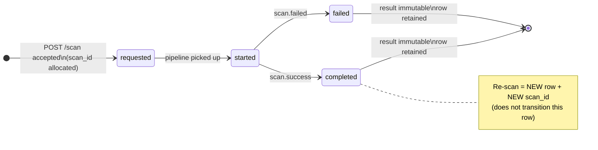
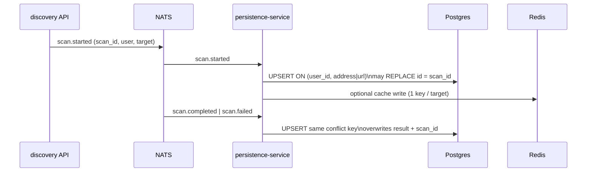
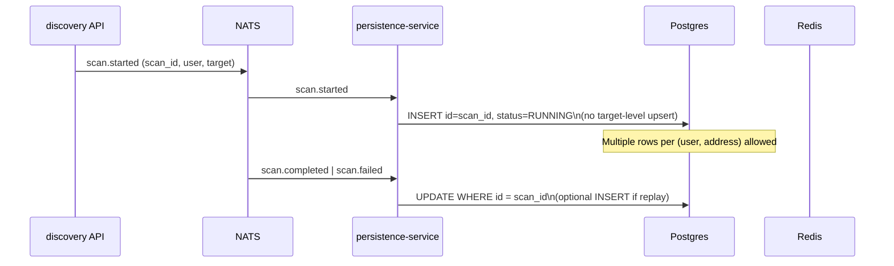

# Scan immutability — gap analysis & migration strategy (IMM-1)

**Status:** **IMM-1** delivered in PR [#64](https://github.com/create2-labs/cafe-discovery/pull/64). Implementation sequence **IMM-2 → IMM-8**; index DDL (**IMM-2**) applied at `cmd/persistence` startup (no separate migration package).

> **English product summary:** [functional-specifications.md](https://github.com/create2-labs/cafe-documentation/blob/main/functional-specifications.md).

**Product contract:** [`cafe-crypto-policy-mgt/workplans/WORKPLAN_API.md`](https://github.com/create2-labs/cafe-crypto-policy-mgt/blob/main/workplans/WORKPLAN_API.md) — **§2.2** (scan lifecycle, invariants, **W1–W8**), **§4.2.1** (list/detail envelopes).

**Implementation plan (PR breakdown):** [`IMMUTABILITE_PR.md`](../IMMUTABILITE_PR.md) at repository root.

**Machine-readable contract:** [`openapi/discovery-v1.yaml`](../openapi/discovery-v1.yaml) — documents immutable `result` after terminal states; full alignment with **W1**, **W6**, multi-row history is tracked in IMM-4 / IMM-12.

---

## 1. Executive summary

Discovery **v1 HTTP** allocates a new **`scan_id`** (UUID) on each accepted `POST /discovery/v1/scan` and exposes list/detail/delete by **`scan_id`**. The **OpenAPI** states that **`result` is immutable** after a terminal lifecycle state.

**Persistence today** does **not** honour that contract: `persistence-service` upserts Postgres rows by **`(user_id, address)`** (wallet) or **`(user_id, url)`** (TLS). A re-scan for the same target **replaces** the row’s **`id`** (`scan_id`) and overwrites **`result`**. Prior **`scan_id`** values may **404** on `GET …/wallets/scans/{scan_id}` even though CPM policies still reference them.

**Target:** one Postgres row **per scan execution** with **`id` = `scan_id`** stable for the lifetime of that row; re-scan = **new row**, **new `scan_id`**; terminal **`result`** never rewritten on that row.

This document records the gap, target invariants, **data migration policy**, Redis role, and the ordered PR sequence (**IMM-2…IMM-8**). No SQL or code changes here.

---

## 2. Current vs target

| Topic | Current (`main`) | Target (`WORKPLAN_API.md` §2.2) |
|-------|------------------|----------------------------------|
| Rows per target | At most **one** Postgres row per `(user_id, address)` or `(user_id, url)` | **One row per execution**; PK **`id` = `scan_id`** |
| Unique indexes | `idx_scan_results_user_address`, `idx_tls_scan_results_user_url` | **Non-unique** `idx_scan_results_user_address_created_at`, `idx_tls_scan_results_user_url_created_at` — **IMM-2** |
| Re-scan same `0x…` / URL | `ON CONFLICT` upsert **replaces** `id`, status, `result` | **INSERT** new row; prior row **unchanged** |
| `OnStarted` if terminal exists | **No-op** (wallet/TLS) — new `scan_id` never persisted | **INSERT** new `RUNNING` row (IMM-3) |
| Lost history | Prior `scan_id` may 404; CPM policy orphan risk | Prior `scan_id` readable until **DELETE** (**W3**) |
| List `?address=&chain_id=` | `FindByUserIDAndAddress` → **≤1** item | All rows for address, filter by `chain_id` (**W5**, IMM-4) |
| Latest completed (**W2**) | No `latest=true` query | `GET …/wallets/scans?address=&latest=true` → ≤1 **`completed`** |
| POST scan guards (**W8**, **W1**) | No in-progress / CPM guards | **409** `SCAN_IN_PROGRESS` / `CPM_EXISTS_FOR_WALLET_TARGET` (IMM-4, IMM-9) |
| CPM explore/persist (**W7**, **W2**) | No lifecycle guard | Newest row must be **`completed`**; persist only latest **`completed`** `scan_id` (IMM-10) |
| CBOM (**W6**) | CBOM not on legacy HTTP surface | `GET …/wallets/scans/{scan_id}/cbom` on demand (IMM-12) |
| Redis | One key per **address** / **URL** | Accelerator only; v1 list/detail **Postgres-first** after IMM-5 |
| Quotas | Row count at POST ; DELETE frees usage | **P1** success-only ledger ; **G1** `successful+in_flight<limit` ; **G2** cap `min(limit,3)` ; **G3** atomic commit ; **G4** CBOM success-only (**IMM-6b**) |

**Already close to target:** **`DELETE …/wallets/scans/{scan_id}`** with **409** `SCAN_REFERENCED_BY_POLICY` when a CPM policy references the scan (**PR6**, **W3**). **`DELETE` CPM** does not delete scans (**W4**).

---

## 3. Target invariants (Discovery + wallet/CPM)

1. **`scan_id`** allocated when the execution is **accepted** (`requested`), before async pipeline publish.
2. **One execution** = **one** Postgres row (`scan_results` / `tls_scan_results`), **`id` = `scan_id`**.
3. After a **terminal** state (`completed` / `failed`), **`result`** in the detail DTO is **immutable** for that **`scan_id`**.
4. **Re-scan** = **new** row + **new** `scan_id`; no “continuation” under the same UUID.
5. **History:** multiple rows per `target_address` / endpoint URL; list via **`GET …/wallets/scans?address=`** (**W5**).
6. **CPM (wallet only):** **W1–W8** per [`IMMUTABILITE_PR.md`](../IMMUTABILITE_PR.md) — notably **W7** (CPM blocked if newest ≠ `completed`) vs **W8** (rescan allowed if newest is `failed`, independent of W7).
7. **CBOM:** derived on read per **`scan_id`**; not stored as blob (**W6**, IMM-12).
8. **Source of truth for v1 HTTP:** **Postgres**; Redis is optional cache (**§5**).

---

## 4. Scan lifecycle (target)



**Terminal states:** `completed`, `failed` (aligned with OpenAPI lifecycle enums and WORKPLAN §2.2).

**Immutability rule:** once terminal, persistence must **not** update `result` (or downgrade status) for that **`scan_id`**. A new execution is always a **new insert**.

---

## 5. NATS → persistence flow (today vs target)

### Today



**Key files (current behaviour):**

| Component | File | Behaviour |
|-----------|------|-----------|
| Index DDL | `cmd/persistence/main.go` | **IMM-2** : drop legacy unique indexes; create list indexes at startup ; **IMM-6b-1** : `scan_usage_events` ledger + `(user_id, scan_kind)` index |
| Ledger entity | `internal/domain/scan_usage_event.go` | Append-only quota ledger (**IMM-6b-1**); writes in **IMM-6b-4** |
| Ledger repository | `internal/repository/scan_usage_ledger_repository.go` | **IMM-6b-2** : `RecordSuccessUsage`, compteurs `successful` / `in_flight` / `visible`, `TryAcquireSuccessSlot` |
| Smoke IMM-6b-2 | `cafe-deploy/scripts/test-discovery-imm6b2-ledger-repo.sh` | `go test -run ScanUsageLedger` + parité SQL Postgres (optionnel) |
| Writers | `internal/persistence/storage/postgres.go` | `WalletWriter` / `TLSWriter` **`ON CONFLICT (user_id, address\|url)`**; `DoUpdates` includes **`id`** |
| Event handlers | `internal/persistence/handlers/scan_events.go` | Delegates to writers; logs “will upsert” on missing row |
| v1 list (filtered) | `internal/handler/discovery_v1_scans.go` | `address` + `chain_id` → `FindByUserIDAndAddress` (single row) |
| Legacy read paths | `internal/service/discovery.go` | `getExistingScan` via `FindByUserIDAndAddress` |
| Cache | `internal/service/user_scan_cache.go` | Warm/read-through **one DTO per address** |

### Target (after IMM-2 + IMM-3)



API list/detail (**IMM-4**, **IMM-5**) read **by `scan_id`** or **list by address** from Postgres; Redis updated to match **IMM-5** decision (latest-by-`created_at` or reduced scope).

---

## 6. Data migration policy

### 6.1 Explicit decision: **no backfill** of lost scan history

Re-scans that already ran under the **upsert** model **overwrote** the previous row. **Prior `scan_id` values and their `result` payloads cannot be reconstructed** without external backups (NATS replay alone is insufficient if events were consumed idempotently into a single row).

**Policy:**

- **Do not** attempt to synthesize historical rows for past re-scans.
- **Do not** split or duplicate the current single row into fictional past executions.
- After **IMM-2** (drop unique indexes) and **IMM-3** (insert-per-`scan_id`), the **first re-scan** for a target that today has one row will create a **second** row with a **new** `scan_id`; the **existing** row remains as the record of the last persisted execution before that point.

### 6.2 Existing environments (one row per target)

No data migration script is required before IMM-2 for typical deployments: each `(user_id, address)` / `(user_id, url)` already has **at most one** row. IMM-2 only relaxes the constraint for **future** inserts.

### 6.3 CPM policies referencing old `scan_id`

If a policy references a **`scan_id` that was overwritten** in Postgres before this migration, **`GET …/wallets/scans/{scan_id}`** may already return **404**. Fixing that is **out of scope** for IMM-1/2/3 (operational: user deletes orphan policy or re-runs assessment after a new scan). Forward behaviour prevents **new** overwrites.

### 6.4 Deployment ordering (summary)

| Phase | PR | Risk if mis-ordered |
|-------|-----|---------------------|
| Doc sign-off | **IMM-1** (this doc) | — |
| Drop unique indexes | **IMM-2** | Writers still upsert → duplicate-key or inconsistent rows until IMM-3 |
| Insert-by-`scan_id` writers | **IMM-3** | Must follow IMM-2 |
| API + OpenAPI | **IMM-4**, **IMM-12**, **IMM-9** | Depend on IMM-3 |
| Redis / legacy paths | **IMM-5** | Depend on IMM-3 |
| Runbook | **IMM-8** (`cafe-deploy`) | Coordinate IMM-2+3 window |

**Rule:** avoid production window where **IMM-2 is live** but **IMM-3 is not** (see IMM-8 runbook).

---

## 7. Redis vs Postgres (source of truth)

| Concern | Postgres | Redis (today) |
|---------|----------|----------------|
| **v1 `GET …/wallets/scans/{scan_id}`** | Authoritative (by PK) | Not used for detail-by-id |
| **v1 list (paginated)** | `ListOwnerWalletScansDiscoveryV1` etc. | Not primary |
| **Legacy / cache paths** | Fallback | Key: `wallet:user:<user_id>:<address>` — **one value per address** |
| **Warm on sign-in** | `FindByUserID` → all entities | `SaveByUserIDAndAddress` per entity — **last write wins** per address if multiple rows existed |
| **Read-through by address** | `FindByUserIDAndAddress` → `ORDER BY created_at DESC` **First** | Same: one cached scan per address |

**Decision for v1 transition (IMM-1, implemented in IMM-5):**

- **Postgres** is the **source of truth** for Discovery v1 list, detail, and delete by **`scan_id`**.
- **Redis** remains an **optional accelerator** for legacy address/URL keyed reads until IMM-5 aligns keys or narrows usage.
- When multiple wallet rows share an address (after IMM-3), **address-keyed Redis** must store the row with **maximum `created_at`** on warm/read-through, **or** skip address-key write-through for v1-only flows — **IMM-5** implements; until then, behaviour is “latest row by `created_at`” via `findByUserIDAndField` in `internal/repository/base_repository.go`.

**Not in scope for IMM-1:** changing Redis key schema to `scan_id` (IMM-5).

---

## 8. OpenAPI & README alignment checklist

Use this when closing IMM-7 / after API PRs; IMM-1 records intended end state.

| Item | Location | After IMM-* |
|------|----------|-------------|
| Immutable `result` after terminal | `openapi/discovery-v1.yaml` — wallet/TLS detail | Already stated; persistence must match (**IMM-3**) |
| Query `latest=true` + `address` required | OpenAPI `GET …/wallets/scans` | **IMM-4** |
| `SCAN_IN_PROGRESS`, `CPM_EXISTS_FOR_WALLET_TARGET` | OpenAPI + handlers | **IMM-4**, **IMM-9** |
| `GET …/wallets/scans/{scan_id}/cbom` | OpenAPI | **IMM-12** |
| List filters `address`, `chain_id` (no single-row bug) | OpenAPI + `discovery_v1_scans.go` | **IMM-4** |
| Maintainer link WORKPLAN §2.2 | `README.md` — § Scan immutability | **IMM-1** (this PR) |
| PR sequence IMM-2…IMM-8 | `IMMUTABILITE_PR.md` | Ongoing |

---

## 9. Implementation sequence (reference)

| ID | Branch (proposed) | Deliverable |
|----|-------------------|-------------|
| **IMM-1** | `docs/scan-immutability-gap-and-migration` | This document |
| **IMM-2** | `discovery/scan-history-db-migration` | Drop unique indexes; add list indexes |
| **IMM-3** | `discovery/scan-history-persistence-writers` | Writers: insert/update by `scan_id` |
| **IMM-4** | `discovery/scan-history-api-list-filters` | List + `latest=true` + **W8** |
| **IMM-5** | `discovery/scan-history-redis-legacy-readpaths` | Redis + legacy paths |
| **IMM-6** | `discovery/scan-history-plan-quota-semantics` | Quota = executions |
| **IMM-7** | `discovery/scan-history-tests-contract` | Contract tests |
| **IMM-8** | `deploy/scan-history-migration-runbook` | Deploy runbook (`cafe-deploy`) |
| **IMM-9** | `discovery/block-scan-when-cpm-exists` | **W1** |
| **IMM-10** | `cpm/latest-scan-only-policy` | **W7** + **W2** (CPM repo) |
| **IMM-12** | `discovery/v1-cbom-by-scan-id` | **W6** |

**Related plans:** [`cafe-crypto-policy-mgt/workplans/IMMUTABILITE_PR.md`](https://github.com/create2-labs/cafe-crypto-policy-mgt/blob/main/workplans/IMMUTABILITE_PR.md), [`cafe-frontend/IMMUTABILITE.md`](https://github.com/create2-labs/cafe-frontend/blob/main/IMMUTABILITE.md).

---

## 10. Review sign-off

| Role | Date | Notes |
|------|------|-------|
| Author (IMM-1 doc) | 2026-05-24 | Gap + no-backfill + Redis policy recorded |
| Maintainer approval (required before IMM-2) | 2026-05-24 | IMM-1 merged [#64](https://github.com/create2-labs/cafe-discovery/pull/64) |

---

## Appendix A — Code anchors

**IMM-2 (index DDL)** — `cmd/persistence/main.go` : `DROP INDEX IF EXISTS` sur les uniques legacy, puis `CREATE INDEX` liste (`idx_*_created_at`). Dev : reset volume Postgres si besoin (pas de migration incrémentale).

**Pre-IMM-3 (writers still upsert)** — `internal/persistence/storage/postgres.go`:

```124:127:internal/persistence/storage/postgres.go
	return w.db.Clauses(clause.OnConflict{
		Columns:   []clause.Column{{Name: "user_id"}, {Name: "address"}},
		DoUpdates: clause.AssignmentColumns([]string{"id", "status", "updated_at"}),
	}).Create(ent).Error
```

```73:75:internal/repository/base_repository.go
func (r *baseRepository[T]) findByUserIDAndField(userID uuid.UUID, fieldName string, fieldValue string, result *T) (*T, error) {
	res := r.db.Where("user_id = ? AND "+fieldName+" = ?", userID, fieldValue).Order("created_at DESC").First(result)
```
